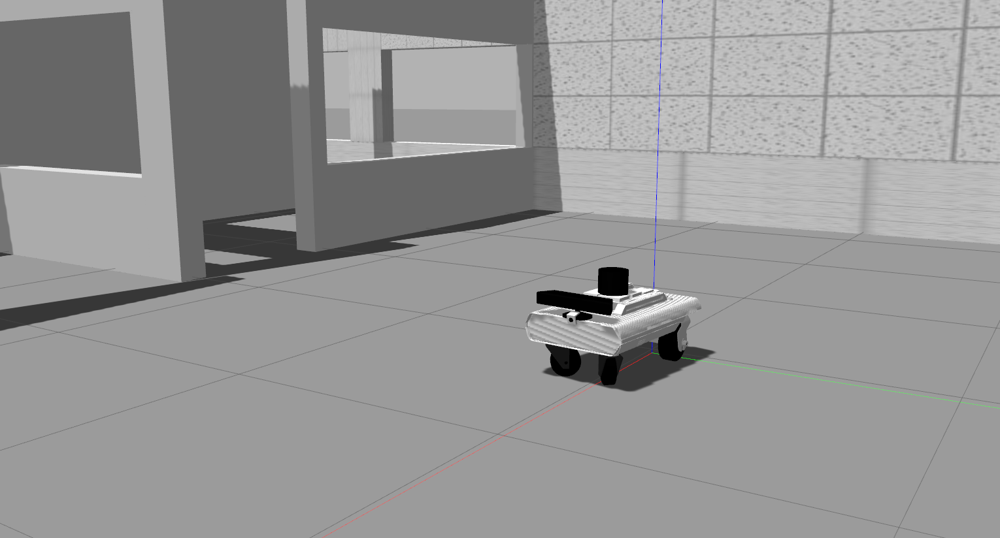
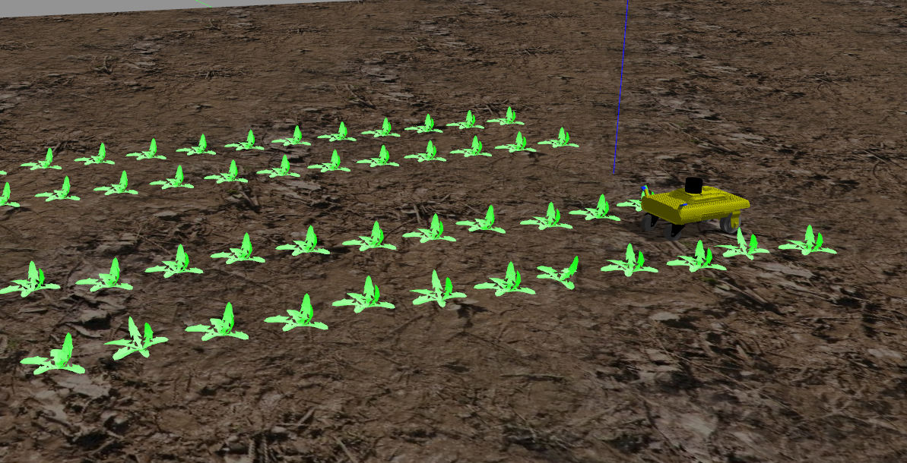
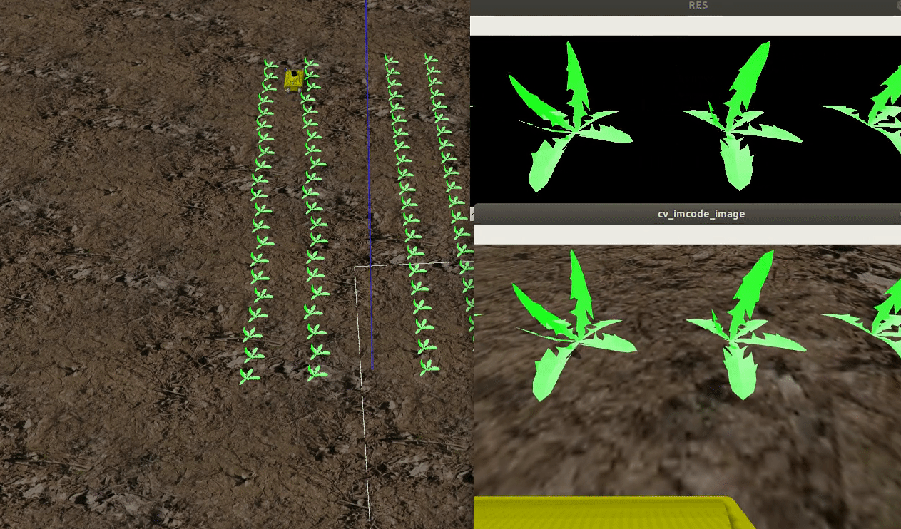
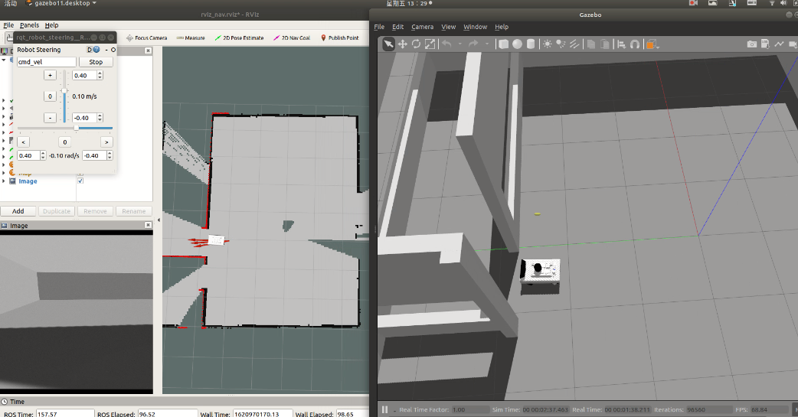
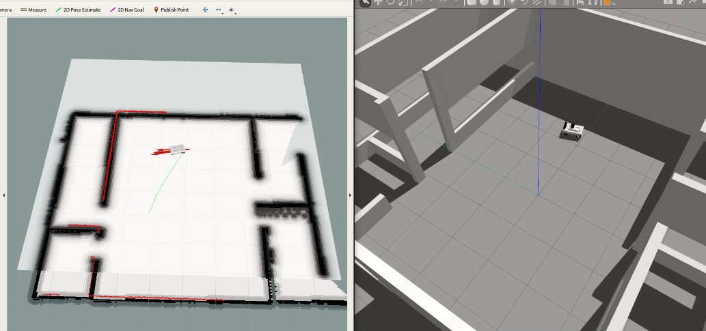

# Chapter One: NEOR in Farm

## Step 1: Install dependence packages

```bash
# Open a Terminal && download codes
git clone https://github.com/COONEO/neor_farm.git
cd neor_farm/neor_ws/ 

#install ros dependence packages
rosdep install --from-paths src --ignore-src --rosdistro=melodic -y
```

change crop_follow_object.py file's permissions,like this:s

allow this file as a execute file.


## Step 2: Visual NEOR URDF in Gazebo

```bash
# open a Terminal
cd ~/neor_farm/neor_ws/
catkin_make
source devel/setup.bash
roslaunch neor neor_gazebo_sensors.launch
```




## Step 3: Visual NEOR in Crop Gazebo World 

```bash
# open a Terminal
# copy models from neor_crop_follow/gazebo_models files      into         .gazebo/models folder.
mkir ~/.gazebo/models
cd ~/neor_farm/neor_ws/src/neor_crop_follow/gazebo_models
cp -r * ~/.gazebo/models/

# compile and launch node
cd ~/neor_farm/neor_ws/
catkin_make
source devel/setup.bash
roslaunch neor_crop_follow gazebo_farm_land.launch
```




Run camera image detect python node.

```bash
# open another Terminal
cd ~/neor_farm/neor_ws/
catkin_make
source devel/setup.bash
rosrun neor_crop_follow crop_follow_object.py     # remember enable execute permission
```




# Chapter Two ： Gmapping and Navigation

## Step 1: NEOR ROS Gmappings

```bash
# open another Terminal
cd ~/neor_farm/neor_ws/
catkin_make
source devel/setup.bash
roslaunch neor_gmapping ekf_gmapping.launch
```



Save map file in : “~/neor_farm/neor_ws/src/neor_navigation/map/” folder.

```bash
#open a new Terminal
cd ~/neor_farm/neor_ws/src/neor_navigation/map
rosrun map_server map_saver -f map
```


## Step 2:NEOR ROS Navigation

```bash
# open another Terminal
cd ~/neor_farm/neor_ws/
catkin_make
source devel/setup.bash
roslaunch neor_navigation nav_test.launch 
```




​																												2021.05.14     

​																											author:ZhaoXiang Lee

COONEO Co.,Ltd

Web:http://cooneo.cc

E: cooneo@outlook.com


For more details,you can search "COONEO" in your WeChat.


